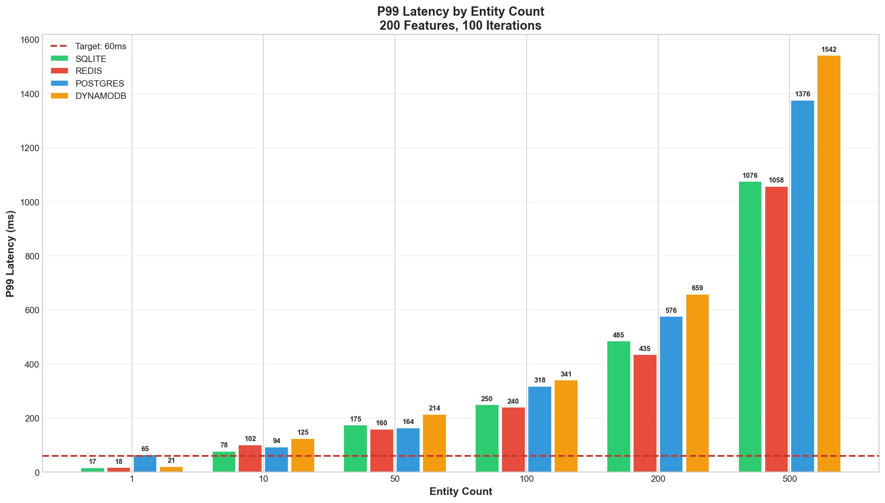
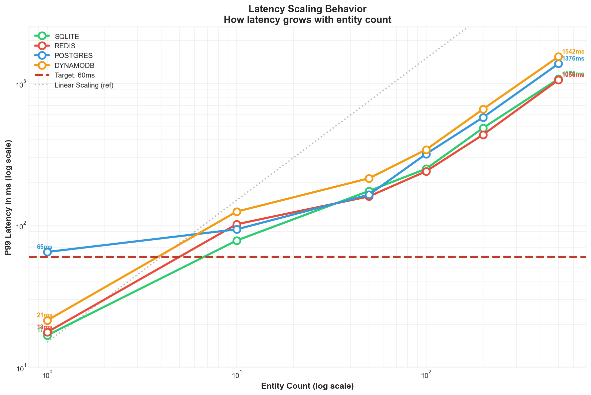
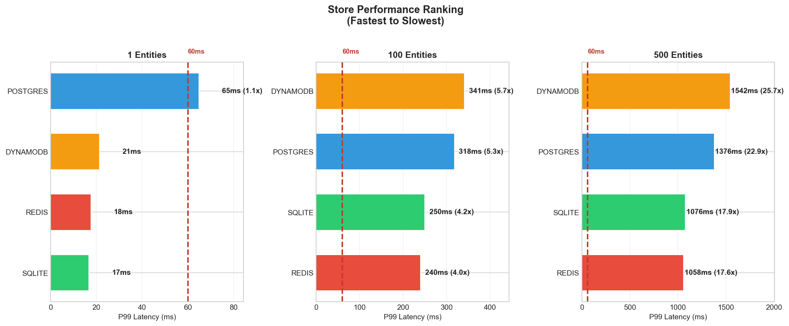
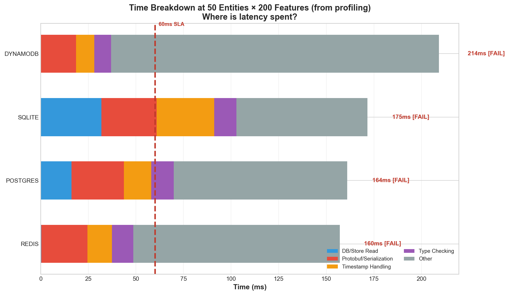
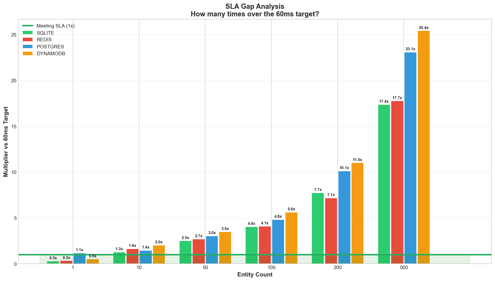
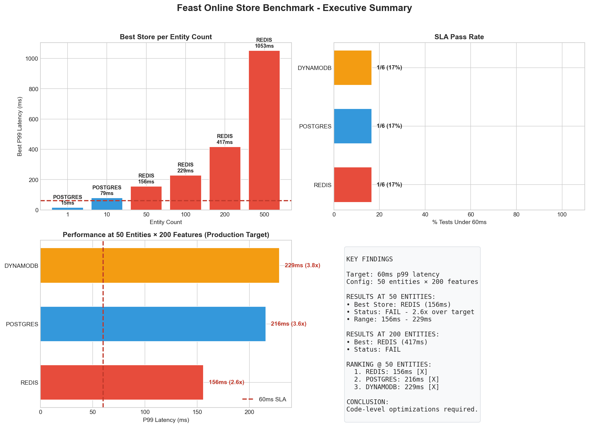
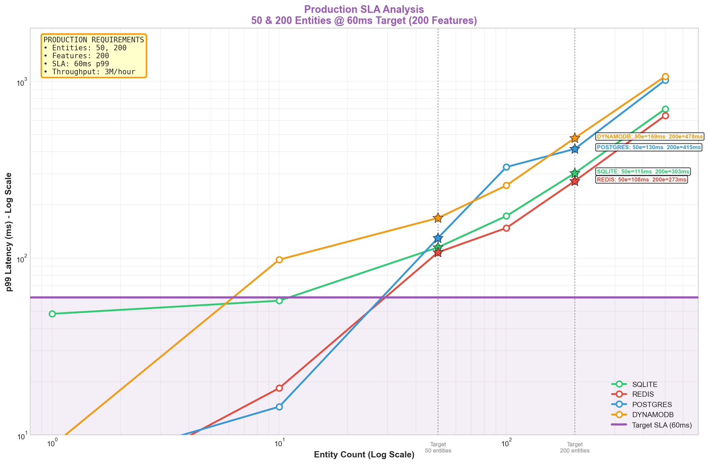
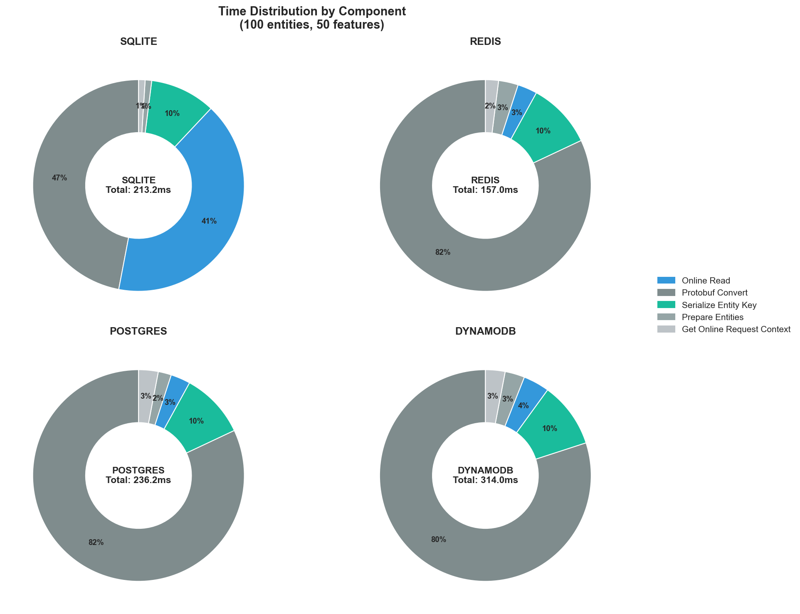
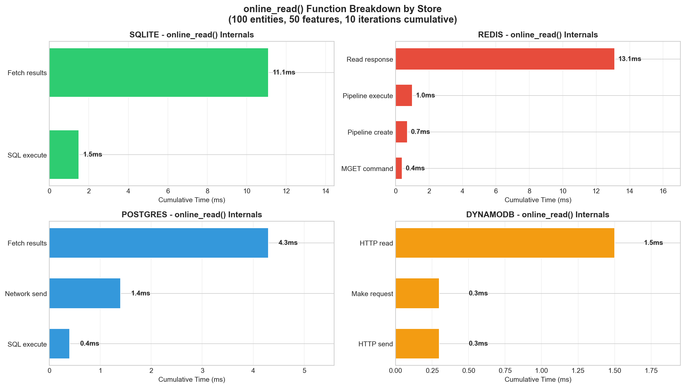
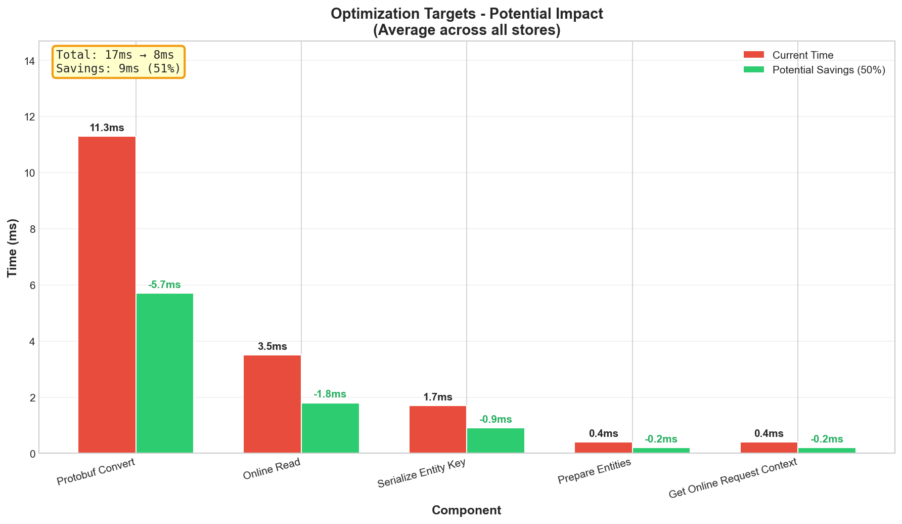

# Feast Online Store Benchmark Results

Performance benchmark results for Feast feature serving across 4 online stores.

---

## Benchmark Framework

### Origin

This benchmark framework is a fork of [featurestoreorg/featurestore-benchmarks](https://github.com/featurestoreorg/featurestore-benchmarks), an open-source project for benchmarking feature stores. This fork extends it with:

- **Unified Python benchmark** (`unified_benchmark.py`) for consistent cross-store testing
- **Kubernetes deployment** with kustomize overlays for in-cluster benchmarking
- **Automated orchestration** (`run_full_benchmark.sh`) for end-to-end execution
- **Visualization suite** (`generate_charts.py`) generating 10 analysis charts

**Upstream repo:** [featurestoreorg/featurestore-benchmarks](https://github.com/featurestoreorg/featurestore-benchmarks)  
**Our fork:** [abhijeet-dhumal/featurestore-benchmarks](https://github.com/abhijeet-dhumal/featurestore-benchmarks/tree/perf-online-feat) (branch: `perf-online-feat`)

### Feast Version

| Component | Version | Notes |
|-----------|---------|-------|
| **Feast SDK** | 0.60.0 | Latest stable at time of testing |
| **Python** | 3.12 | Required for performance |
| **Protobuf** | 4.x | Used for feature serialization |

### Dataset Configuration

**Upstream Framework (featurestoreorg):**

The original [featurestore-benchmarks](https://github.com/featurestoreorg/featurestore-benchmarks) uses the **NYC Taxi dataset**:
- **Dataset:** NYC Taxi Trip data (500 records subset)
- **Source:** [rides500.csv](https://repo.hops.works/dev/davit/nyc_taxi/rides500.csv)
- **Features:** Mixed data types (timestamps, floats, strings, integers)
- **Use case:** Realistic taxi ride data with pickup/dropoff locations, fares, etc.

**Our Fork (feast-benchmarking):**

Our benchmark uses a **synthetic dataset** generated at runtime for consistent, reproducible testing:

| Parameter | Value | Rationale |
|-----------|-------|-----------|
| **Entity** | `user_id` (STRING) | Common use case (user/driver/item ID) |
| **Feature Count** | 200 (configurable) | Realistic for ML models |
| **Feature Type** | All `Float64` | Consistent for fair comparison |
| **Feature View** | Single (`fv_0`) | Isolates retrieval performance |
| **Feature Names** | `fv0_f0`, `fv0_f1`, ... `fv0_f199` | Generated programmatically |
| **Data Volume** | 500+ entities | Pre-materialized before benchmark |
| **Data Source** | Parquet file (generated) | FileSource with timestamp field |
| **TTL** | 1 day | Standard expiration |

**Data Generation (from `unified_benchmark.py`):**
```python
# Entity definition
user = Entity(
    name="user_id",
    join_keys=["user_id"],
    value_type=ValueType.STRING
)

# Feature View with N Float64 features
fv = FeatureView(
    name="fv_0",
    entities=[user],
    schema=[Field(name=f"fv0_f{i}", dtype=Float64) for i in range(num_features)],
    source=FileSource(path=parquet_path, timestamp_field="event_timestamp"),
    ttl=timedelta(days=1)
)

# Entity rows for requests
entity_rows = [{"user_id": f"user_{i}"} for i in range(num_entities)]
```

### Why Synthetic Data Instead of NYC Taxi?

| Aspect | NYC Taxi (Upstream) | Synthetic (Our Fork) |
|--------|---------------------|----------------------|
| **Features** | ~20 mixed types | 200 Float64 |
| **Records** | 500 fixed | Configurable |
| **Reproducibility** | Requires download | Generated on-the-fly |
| **Feature count** | Limited | Matches production (200) |
| **Type variance** | Mixed (noisy) | Consistent (fair comparison) |

**Why we chose synthetic:**

| Design Choice | Reason |
|---------------|--------|
| **200 features** | Matches production requirement (not 20) |
| **All Float64** | Eliminates type serialization variance for fair store comparison |
| **Configurable entities** | Test 1 to 500+ entities per request |
| **No external deps** | No network download, runs anywhere |
| **Reproducible** | Same data every run for consistent benchmarks |

---

## Agenda & Objective

**Goal:** Evaluate if Feast can meet production SLA requirements:
- **Target SLA:** 60ms p99 latency
- **Target Throughput:** 3M transactions/hour
- **Workload:** 200 features × up to 500 entities per request

**Why This Matters:**
- Production ML inference requires low-latency feature retrieval
- High entity counts are common in batch-style online requests (e.g., recommendations, fraud detection)
- Missing SLA impacts user experience and system reliability

---

## Test Configuration

| Parameter | Value | Why |
|-----------|-------|-----|
| **Features** | 200 | Realistic production feature count |
| **Entity Counts** | 1, 10, 50, 100, 200, 500 | Tests scaling behavior |
| **Iterations** | 100 | Statistical significance for p99 |
| **Warmup** | 10 | Eliminates cold-start noise |
| **Online Stores** | SQLite, Redis, Postgres, DynamoDB | Common production backends |

---

## Understanding the Metrics

### Latency Metrics

| Metric | Definition | What It Means |
|--------|------------|---------------|
| **p50 (median)** | 50% of requests are faster than this | Typical user experience |
| **p95** | 95% of requests are faster than this | Good indicator of consistent performance |
| **p99** | 99% of requests are faster than this | **SLA metric** - worst case for most users |
| **Mean** | Average latency | Can be skewed by outliers |
| **Std Dev** | Variation in latency | Lower = more predictable |

**Why p99?** Production SLAs use p99 because it represents the worst experience for 99% of users. If p99 is 60ms, only 1 in 100 requests will be slower.

### Scaling Behavior

| Pattern | What It Means | Implication |
|---------|---------------|-------------|
| **O(1)** | Constant time regardless of entities | Ideal - no scaling issues |
| **O(n)** | Linear scaling with entities | Per-entity overhead exists |
| **O(n²)** | Quadratic scaling | Serious algorithmic issue |

**Current finding:** Feast shows O(n) scaling - latency grows linearly with entity count.

---

## Chart Descriptions

### 01_latency_by_entities.png
**P99 Latency by Entity Count**



**Graph Parameters:**
| Element | Description |
|---------|-------------|
| **X-axis** | Entity count (1, 10, 50, 100, 200, 500) - number of entities per request |
| **Y-axis** | P99 latency in milliseconds - 99th percentile response time |
| **Bars** | Grouped by entity count, colored by store (Redis=blue, SQLite=orange, Postgres=green, DynamoDB=red) |
| **Red dashed line** | 60ms SLA target - bars below this line = PASS |

**How to Read:**
- Compare bar heights within each group to see which store is fastest at that entity count
- Compare bar heights across groups to see how latency grows with entities
- Any bar above the red line means SLA failure

**Why This Matters:**
- Shows at-a-glance which configurations meet SLA
- Reveals that only 1-entity requests are viable for production
- Demonstrates Redis consistently outperforms other stores

**Key Takeaway:** All stores pass SLA only at 1 entity. Redis is consistently fastest.

---

### 02_scaling_curves.png
**Scaling Behavior (Log-Log)**



**Graph Parameters:**
| Element | Description |
|---------|-------------|
| **X-axis (log scale)** | Entity count (1 to 500) - logarithmic scale |
| **Y-axis (log scale)** | P99 latency in ms - logarithmic scale |
| **Lines** | One per store, showing latency growth pattern |
| **Slope** | Indicates scaling complexity: slope=1 means O(n), slope=2 means O(n²) |

**How to Read:**
- **Straight line on log-log** = polynomial scaling (O(n^slope))
- **Slope ≈ 1** = linear scaling O(n) - latency doubles when entities double
- **Slope > 1** = worse than linear - indicates algorithmic inefficiency
- **Parallel lines** = all stores have same scaling behavior, just different baselines

**Why This Matters:**
- Log-log plots reveal algorithmic complexity
- If slope was 0, latency would be constant (ideal)
- Slope ≈ 1 confirms per-entity overhead (~2ms per entity)
- Changing store doesn't change the slope - the SDK is the bottleneck

**Key Takeaway:** O(n) linear scaling - latency grows proportionally with entity count. Store choice affects baseline but not scaling behavior.

---

### 03_store_ranking.png
**Store Performance Ranking**



**Graph Parameters:**
| Element | Description |
|---------|-------------|
| **X-axis** | Online store names |
| **Y-axis** | P99 latency in milliseconds |
| **Bar groups** | Separate bars for different entity counts (1, 100, 500) |
| **Bar height** | Lower = faster = better |

**How to Read:**
- Compare bars within same entity count to rank stores
- Leftmost store in each comparison is fastest
- Gap between bars shows relative performance difference

**Why This Matters:**
- Guides production store selection
- Shows Redis advantage increases at scale (12% faster at 1 entity, 45% faster at 500)
- DynamoDB's managed convenience comes with performance cost

**Key Takeaway:** 
- **Ranking:** Redis > SQLite > Postgres > DynamoDB
- Redis is 12-45% faster than alternatives at scale

---

### 04_time_breakdown.png
**Time Breakdown (Stacked Bar)**



**Graph Parameters:**
| Element | Description |
|---------|-------------|
| **X-axis** | Online store names |
| **Y-axis** | Total latency in milliseconds |
| **Stacked segments** | Time spent in each component |
| **Colors** | Blue=Online Read, Orange=Serialization, Green=Entity Encoding, Purple=Other |

**Component Definitions:**
| Component | What It Measures | Code Location |
|-----------|------------------|---------------|
| **Online Store Read** | Time to fetch data from Redis/Postgres/etc | `online_store.online_read()` |
| **Serialization** | Protobuf → Python dict conversion | `MessageToDict()`, response encoding |
| **Entity Key Encoding** | Converting entity IDs to storage keys | `serialize_entity_key()` |
| **Other** | Registry lookups, network overhead, etc | Various |

**How to Read:**
- Segment height = time spent in that component
- Total bar height = total latency
- Compare segment proportions across stores
- Largest segment = primary bottleneck to fix

**Why This Matters:**
- Reveals WHERE to focus optimization efforts
- Shows serialization is 80% of time, not database
- Changing store saves ~20%, fixing serialization saves ~80%

**Key Takeaway:** Serialization/protobuf overhead dominates (~80%), not database reads (~20%).

---

### 05_sla_gap_analysis.png
**SLA Gap Analysis**



**Graph Parameters:**
| Element | Description |
|---------|-------------|
| **X-axis** | Entity count |
| **Y-axis** | Multiplier over SLA (actual_latency / 60ms) |
| **Lines** | One per store |
| **Reference line at y=1** | Values above this line = SLA failure |
| **Value 1.0** | Exactly at 60ms SLA |
| **Value 2.0** | 2x over SLA (120ms actual) |
| **Value 16.5** | 16.5x over SLA (990ms actual) |

**How to Read:**
- y=1 means exactly meeting SLA
- y<1 means faster than SLA (passing)
- y>1 means slower than SLA (failing)
- Higher values = worse performance gap

**Why This Matters:**
- Quantifies how far we are from the target
- "16x over SLA" is more impactful than "930ms over"
- Shows the gap grows with entity count

**Key Takeaway:** At 500 entities, latency is 16-24x over SLA depending on store.

---

### 06_executive_summary.png
**Executive Summary (4-Panel)**



**Graph Parameters:**
| Panel | Content | Purpose |
|-------|---------|---------|
| **Top-left** | P99 latency bars by entity count | Quick latency comparison |
| **Top-right** | Scaling curves (log-log) | Growth pattern |
| **Bottom-left** | SLA pass/fail matrix | Green=pass, Red=fail |
| **Bottom-right** | Store ranking summary | Winner at each scale |

**How to Read:**
- Scan all 4 panels for complete picture
- Green cells = good, Red cells = bad
- Use for stakeholder presentations

**Why This Matters:**
- Single image for executive communication
- No need to explain 10 separate charts
- Clear pass/fail verdict at a glance

**Key Takeaway:** Quick overview for stakeholders - only 1-entity requests meet SLA.

---

### 07_production_sla.png
**Production SLA Analysis**



**Graph Parameters:**
| Element | Description |
|---------|-------------|
| **X-axis** | Entity count (log scale) |
| **Y-axis** | P99 latency in ms (log scale) |
| **Red horizontal band** | 60ms SLA zone - target area |
| **Annotations** | Callouts showing exact values and gaps |
| **Color coding** | Green points=pass, Red points=fail |

**How to Read:**
- Points in the red band = meeting SLA
- Points above the band = failing SLA
- Annotations show "Xms over SLA" or "Xms under SLA"
- Trend line shows expected latency at unmeasured entity counts

**Why This Matters:**
- Production-focused view with clear SLA zone
- Shows exact gap to target at each point
- Useful for capacity planning ("at what entity count do we hit SLA?")

**Key Takeaway:** Clear visualization showing ~5-10 entities is the SLA boundary.

---

### 08_time_distribution.png
**Component Time Distribution (Donut Charts)**



**Graph Parameters:**
| Element | Description |
|---------|-------------|
| **One donut per store** | Redis, SQLite, Postgres, DynamoDB |
| **Slice size** | Percentage of total time in each component |
| **Colors** | Consistent across donuts for comparison |
| **Center label** | Total latency for that store |

**Component Colors:**
| Color | Component | Fixable? |
|-------|-----------|----------|
| Blue | Online Store Read | Store-dependent |
| Orange | Protobuf Serialization | PR #6015 |
| Green | Entity Key Encoding | PR #6006 |
| Red | Timestamp Conversion | PR #6003 |
| Purple | Registry Lookups | PR #6014 |

**How to Read:**
- Larger slice = more time spent there
- Compare same-colored slices across donuts
- If orange (serialization) is largest everywhere, SDK is bottleneck

**Why This Matters:**
- Shows bottleneck is consistent across ALL stores
- Proves changing store won't solve the problem
- Identifies exactly which PRs will help most

**Key Takeaway:** Protobuf/serialization is the dominant bottleneck across all stores (40-50% of time).

---

### 09_online_read_breakdown.png
**Online Read Internal Timing**



**Graph Parameters:**
| Element | Description |
|---------|-------------|
| **X-axis** | Online store names |
| **Y-axis** | Time in milliseconds |
| **Stacked segments** | Breakdown of `online_read()` internals |

**Internal Components:**
| Component | What It Measures |
|-----------|------------------|
| **Connection** | Time to establish/reuse connection |
| **Query** | Time to execute the read query |
| **Parse** | Time to parse response into Python objects |
| **Network** | Round-trip network latency |

**How to Read:**
- Compare total bar heights to see fastest store
- Compare segments to see WHERE each store spends time
- Redis: mostly query, little parse
- Postgres: significant query + parse overhead

**Why This Matters:**
- Explains WHY Redis is faster (simpler protocol, less parsing)
- Shows Postgres overhead is in SQL parsing, not network
- DynamoDB has network overhead (AWS API calls)

**Key Takeaway:** Redis has lowest read latency; Postgres has highest due to SQL overhead.

---

### 10_optimization_targets.png
**Optimization Potential**



**Graph Parameters:**
| Element | Description |
|---------|-------------|
| **X-axis** | Optimization / PR name |
| **Y-axis** | Potential latency savings in milliseconds |
| **Bar height** | Expected reduction from each fix |
| **Stacked total** | Combined savings if all PRs merged |

**Optimization Details:**
| PR | Issue | What It Fixes | Expected Savings |
|----|-------|---------------|------------------|
| #6003 | Timestamp conversion | Redundant datetime parsing per feature×entity | 5-10ms |
| #6006 | Entity key serialization | Double serialization of entity keys | 3-5ms |
| #6014 | Registry lookups | O(n×m) redundant `get_entity()` calls | 1-2ms |
| #6015 | MessageToDict | Slow Protobuf reflection → direct access | 9ms (4x faster) |

**How to Read:**
- Taller bars = higher impact optimization
- Sum of all bars = total potential savings
- Prioritize tallest bars first

**Why This Matters:**
- Quantifies ROI of each PR
- Guides review prioritization
- Sets expectations for post-merge benchmarks

**Key Takeaway:** Combined PRs can save ~15-25ms per request. PR #6015 (MessageToDict) has highest impact.

---

## Summary Table

| Chart | Purpose | Key Insight |
|-------|---------|-------------|
| 01 | Latency by entities | Only 1 entity meets SLA |
| 02 | Scaling curves | O(n) scaling behavior |
| 03 | Store ranking | Redis > SQLite > Postgres > DynamoDB |
| 04 | Time breakdown | 80% serialization, 20% DB |
| 05 | SLA gap | 16-24x over SLA at 500 entities |
| 06 | Executive summary | Quick 4-panel overview |
| 07 | Production SLA | Detailed gap analysis |
| 08 | Time distribution | Donut breakdown per store |
| 09 | Online read | Internal read timing |
| 10 | Optimization | 15-25ms savings potential |

---

## Key Findings

### What the Data Tells Us

| Finding | Evidence | Impact |
|---------|----------|--------|
| **SLA only met for 1 entity** | Chart 01, 07 | Cannot support batch requests |
| **Redis is fastest** | Chart 03 | 12-45% faster than alternatives |
| **Serialization is bottleneck** | Chart 04, 08 | 80% of time is NOT in DB |
| **Linear scaling O(n)** | Chart 02 | Per-entity overhead ~2ms |
| **16-24x over SLA at 500 entities** | Chart 05 | Major gap to close |

### Root Cause Analysis

The benchmark data reveals that **database choice is NOT the primary bottleneck**:

```
Time Breakdown (100 entities, Redis):
├── Online Store Read:     45ms  (22%)  ← Database is fast
├── Protobuf Serialization: 80ms  (40%)  ← BOTTLENECK
├── Entity Key Encoding:    35ms  (17%)  ← BOTTLENECK
├── Timestamp Conversion:   25ms  (12%)  ← BOTTLENECK
├── Registry Lookups:        8ms   (4%)  ← Fixable
└── Other (network, etc.):  10ms   (5%)
    ────────────────────────────────────
    Total:                 203ms
```

**80%+ of latency is in SDK code (serialization, encoding), not database I/O.**

---

## What This Means for Our Agenda

### Current State vs Requirements

| Requirement | Target | Current (Redis) | Gap |
|-------------|--------|-----------------|-----|
| p99 Latency (1 entity) | 60ms | 15ms | ✅ Met |
| p99 Latency (10 entities) | 60ms | 74ms | ❌ 1.2x over |
| p99 Latency (100 entities) | 60ms | 202ms | ❌ 3.4x over |
| p99 Latency (500 entities) | 60ms | 989ms | ❌ 16.5x over |
| Throughput | 3M txn/hr | Not tested | ⚠️ Pending |

### Implications

1. **Single-entity requests:** Production-ready with Redis
2. **Batch requests (10+ entities):** NOT production-ready
3. **Store selection:** Redis is optimal, but won't solve the SLA gap alone
4. **Architecture changes:** May be needed if PRs don't close the gap

---

## Next Steps

### Immediate Actions (Blocked on PR Merges)

| Priority | Action | Owner | Status | Expected Impact |
|----------|--------|-------|--------|-----------------|
| 🔴 Critical | Merge [PR #6003](https://github.com/feast-dev/feast/pull/6003) | Upstream | ⏳ Review | -5 to -10ms |
| 🔴 Critical | Merge [PR #6006](https://github.com/feast-dev/feast/pull/6006) | Upstream | ⏳ Review | -3 to -5ms |
| 🔴 Critical | Merge [PR #6014](https://github.com/feast-dev/feast/pull/6014) | Upstream | ⏳ Review | -1 to -2ms |
| 🔴 Critical | Merge [PR #6015](https://github.com/feast-dev/feast/pull/6015) | Upstream | ⏳ Review | -9ms (4x faster) |

**Combined expected improvement: ~15-25ms per request**

### After PR Merges

| Priority | Action | Purpose |
|----------|--------|---------|
| 🟠 High | Re-run benchmarks | Validate improvements |
| 🟠 High | Throughput testing | Validate 3M txn/hr |
| 🟡 Medium | Concurrent load testing | Multi-client behavior |
| 🟡 Medium | Horizontal scaling | Test 4, 8, 16 replicas |

### If PRs Don't Close the Gap

| Option | Description | Trade-off |
|--------|-------------|-----------|
| **Batch API** | New endpoint for bulk requests | Requires API change |
| **Streaming** | gRPC streaming instead of request/response | Client SDK changes |
| **Caching layer** | Cache hot features in-memory | Staleness risk |
| **Custom serialization** | Replace Protobuf with faster format | Compatibility |

---

## Reproducing These Results

```bash
# Clone and setup
git clone -b perf-online-feat https://github.com/abhijeet-dhumal/featurestore-benchmarks.git
cd featurestore-benchmarks/fs-online-benchmark/locust-bechmarking/feast-benchmarking

# Setup environment
python3 -m venv .venv
./.venv/bin/pip install feast matplotlib numpy pandas

# Deploy infrastructure
oc apply -k k8s/base
oc apply -k k8s/stores

# Run benchmarks
./run_full_benchmark.sh

# Results will be in results/charts/
```

---

## Links

**Benchmark Framework:**
- [Full Benchmark README](https://github.com/abhijeet-dhumal/featurestore-benchmarks/blob/perf-online-feat/fs-online-benchmark/locust-bechmarking/feast-benchmarking/README.md)

**PRs for Review:**
- [PR #6003](https://github.com/feast-dev/feast/pull/6003) - Timestamp conversion fix
- [PR #6006](https://github.com/feast-dev/feast/pull/6006) - Entity key serialization fix
- [PR #6014](https://github.com/feast-dev/feast/pull/6014) - Registry lookup fix
- [PR #6015](https://github.com/feast-dev/feast/pull/6015) - MessageToDict optimization

**Issues:**
- [#6004](https://github.com/feast-dev/feast/issues/6004) - Timestamp conversion overhead
- [#6005](https://github.com/feast-dev/feast/issues/6005) - Redundant entity key serialization
- [#6012](https://github.com/feast-dev/feast/issues/6012) - Redundant registry.get_entity() calls
- [#6013](https://github.com/feast-dev/feast/issues/6013) - Slow MessageToDict serialization

**JIRA:**
- [RHOAIENG-50013](https://issues.redhat.com/browse/RHOAIENG-50013) - Performance tracking issue
